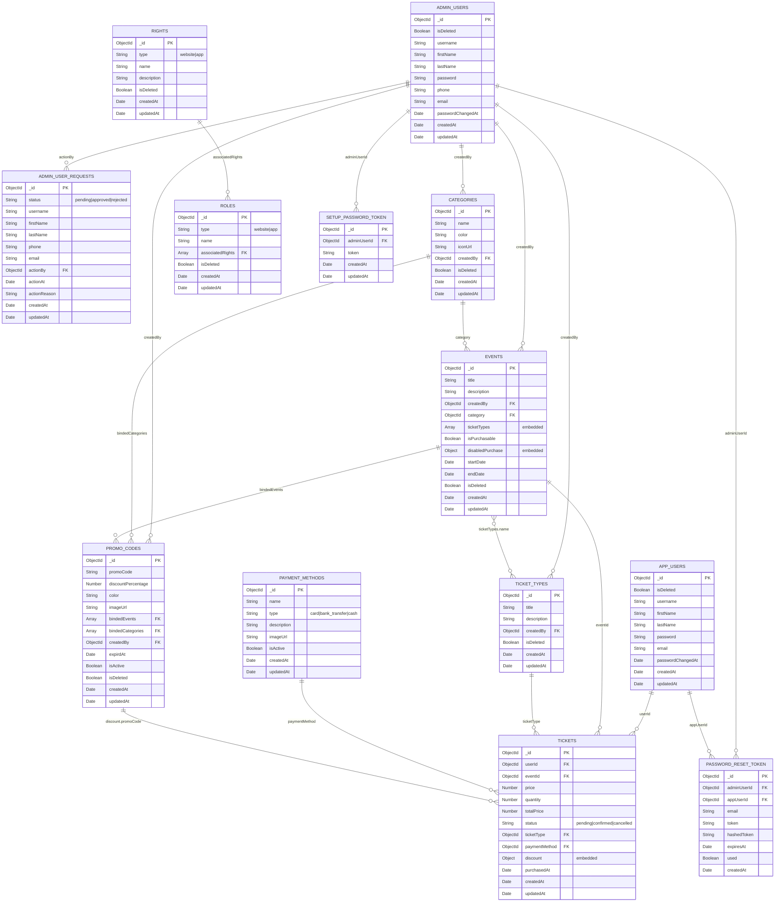

# 🎟️ Event Booking Backend

A modular and scalable **Node.js** backend for managing users, events, ticketing, and promotions.

---

## 🔧 Requirements

- **Node.js**: `v20.18.3`
- **MongoDB**: Cloud or local database instance

---

## 📁 Project Structure

```
.
├── exports/         # Reusable utility modules
├── helpers/         # General-purpose helper functions
├── middlewares/     # Express middleware (e.g., auth)
├── models/          # Mongoose schemas and models
├── routes/          # API route definitions
├── services/        # Core business logic
├── validations/     # Input validation rules (e.g., Joi)
```

---

## 🚀 Getting Started

### 1. Clone the Repository

```bash
git clone https://github.com/your-username/up-blog.git
cd up-blog
```

### 2. Install Node Version

Use `nvm` to install and use the required Node.js version:

```bash
nvm install 20.18.3
nvm use 20.18.3
```

### 3. Install Dependencies

```bash
npm install
```

### 4. Configure Environment Variables

Create a `.env` file in the root directory and populate it with the following:

```
PORT=8080
USE_DB=db_name

# Max upload size
LIMIT_BODY_PARSER=50mb

# MongoDB connection
DATABASE_CONNECTION_STRING=mongodb+srv://<account>:<password>@<host>/<db_name>?retryWrites=true&w=majority

# Email config
EMAIL_USER=your_email
EMAIL_APP_PASSWORD=your_app_password

# App config
FRONTEND_URL=http://localhost:3000
NODE_ENV=development
JWT_SECRET=your_secret
```

> ⚠️ Replace `<account>`, `<password>`, `<host>`, and `<db_name>` with your actual MongoDB Atlas credentials.

### 5. Run the Server

```bash
npm start
```

Visit the API: [http://localhost:8080](http://localhost:8080)

---

## 📘 Features

- 👥 Admin & User role support
- 🔐 JWT Authentication
- 📧 Email verification & password reset
- 🏷️ Event categories and promo codes
- 🎫 Ticket types and purchases
- 💳 Payment method options
- 🌍 i18n/multi-language support
- 📤 File upload support (limit: 50MB)

## 🧩 Entity Relationship Diagram



> **Note:** This ERD shows the MongoDB collections and their relationships. Embedded documents like `ticketTypes` in events and `discount` in tickets are noted with "embedded" labels.

## 📌 Additional Notes

- Ensure your MongoDB URI is correct and accessible.
- Make sure the email config allows SMTP access (e.g., Gmail app password).
- This backend is meant to support a separate frontend (React/Vue/etc.).

---

## 📄 License

This project is licensed under the **MIT License**.
